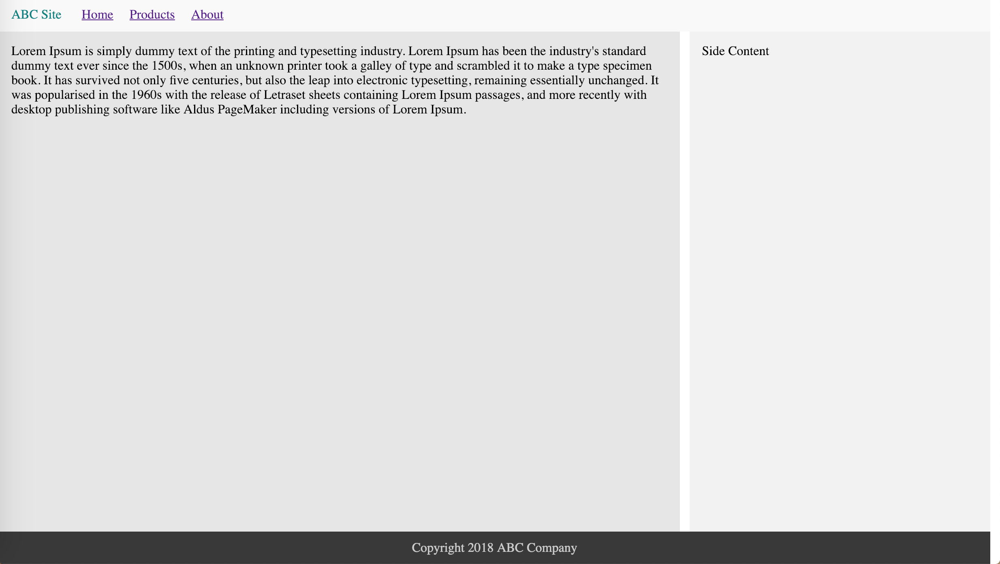
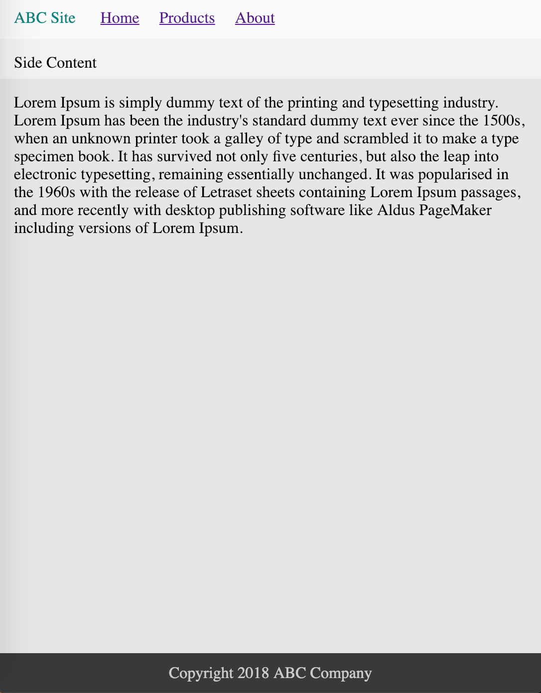

# QLayout

## Start Testing Server and See the Demo
Install a node package to help you start a http server easily.

```
$ npm i live-server
$ ./start.sh
```

examples

### screen (min-width: 800)


### screen (max-width: 800)


## layout.html
This is a example of responsive html home page. Using CSS Grid and flex.

